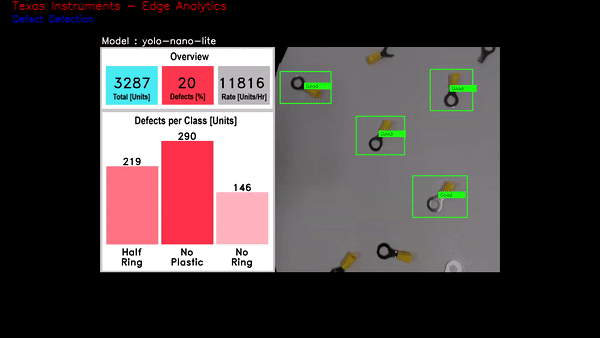
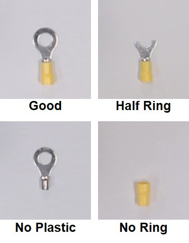

# Defect Detection using Vision based Edge AI
> Repository to host GStreamer based Edge AI applications for TI devices

This repo adds a vision based defect detection support.

## Table of content
- [Defect Detection using Vision based Edge AI](#defect-detection-using-vision-based-edge-ai)
  - [Table of content](#table-of-content)
  - [About Defect Detection Demo](#about-defect-detection-demo)
  - [Supported Devices](#supported-devices)
  - [EVM Setup](#evm-setup)
  - [Demo Setup and Running](#demo-setup-and-running)
  - [Result](#result)
  - [How It's Made](#how-its-made)
  - [Resources](#resources)

## About Defect Detection Demo
This is a demo using **[AM62A](https://www.ti.com/tool/SK-AM62A-LP)** to run a vision based artificial intelligent model for defect detection for manufacturing applications. The model tests the produced units as they move on a conveyer belt, to recognized the accepted and the defected units. The demo is equipped with an object tracker to provide accurate coordinates of the units for sorting and filtering process. A live video is displayed on the screen with green and red boxes overlaid on the accepted and defected units respectively. The screen also includes a graphical dashboard showing live statistics bout total products, defect percentage, production rate, and a histogram of the types of defect. This demo is built based on the the edgeai-gst-apps. It runs on Python only for this current version.

This demo runs a custom trained YOLOX-nano neural network[^1] on the **[AM62A](https://www.ti.com/tool/SK-AM62A-LP)** and performs object detection on imagery to find 


See [Resources](#resources) for links to AM62A and other Edge AI training material.

## Supported Devices

| **DEVICE**              | **Supported**      |
| :---:                   | :---:              |
| AM62A                   | :heavy_check_mark: |

## EVM Setup

Follow the [AM62A Quick Start guide](https://dev.ti.com/tirex/explore/node?node=A__AQniYj7pI2aoPAFMxWtKDQ__am62ax-devtools__FUz-xrs__LATEST) for the [AM62A Starter Kit](https://www.ti.com/tool/SK-AM62A-LP)
* Download the [Edge AI SDK](https://www.ti.com/tool/download/PROCESSOR-SDK-LINUX-AM62A) from ti.com. 
    * Ensure that the tisdk-edgeai-image-am62axx.wic.xz is being used.
* Install the SDK onto an SD card using a tool like Balena Etcher.
* Connect to the device (EVM) and login using a UART connection or a netowrk conneciton through an SSH session.

## Demo Setup and Running
1. Clone this repo in your target under /opt

    ```console
    root@am62axx-evm:/opt# git clone https://github.com/TexasInstruments/edgeai-gst-apps-defect-detection
    root@am62axx-evm:/opt# cd edgeai-gst-apps-defect-detection
    ```

2. Run the setup script below within this repository *on the EVM*. This requires an internet connection on the EVM. 
*  An ethernet connection is recommended. 
*  Proxy settings for HTTPS_PROXY may be required if the EVM is behind a firewall.

    ```console
    ./setup-defect-detection.sh
    ```

    This script will download the following:
    a. A pretrained defect detection model based on yolox-nano-lite[^1] and install it under /opt/model_zoo in the filesystem.
    b. The test video to run the demo without the need to a camera.


3. Run commands as follows from the base directory of this repo on the EVM.

    ```console
    root@am62axx-evm:/opt/edgeai-gst-apps-defect-detection# cd apps_python
    ```
    * To run the demo using the pre-recorded test video as input:
    ```console
    root@am62axx-evm:/opt/edgeai-gst-apps-defect-detection/apps_python# ./app_edgeai.py ../configs/defect_detection_test_video.yaml
    ```
   * To run the demo using a CSI camera as input:
    ```console
    root@am62axx-evm:/opt/edgeai-gst-apps-defect-detection/apps_python# ./app_edgeai.py ../configs/defect_detection_camera.yaml
    ```

## Result
The application shows two main sections on the screen: live feed of the input video and a graphical dashboard. The live video is overlaied boxes on the detected objects. The green boxes represent accepted (good) objects while the defected objects are overlaied with various shades of red to distingush their defect types. The dashboard graphically shows an overview of the whole prduction perforamnce including the total produced units since start of operation, the percentage of the defected units, and the produciton rate as units per hour. The dashboard also shows a histogram detailing the types of detected defects. 


## How It's Made
The demo is built by custom trainning YOLOX-nano model. Four classes are used to train the model: Good (accepted) and three classes of defects including Half Ring, No Plastic, No Ring. 



## Resources


| Purpose | Link/Explanation | 
| ------- | ----- | 
|AM62A product page (superset) | https://www.ti.com/product/AM62A7 
| AM62A Starter Kit EVM | https://www.ti.com/tool/SK-AM62A-LP 
| EVM Supporting documentation | https://dev.ti.com/tirex/explore/node?node=A__AA3uLVtZD76DOCoDcT9JXg__am62ax-devtools__FUz-xrs__LATEST
| Master Edge AI page on Github |  https://github.com/TexasInstruments/edgeai 
| Edge AI Cloud | https://dev.ti.com/edgeaistudio/
| Model Analyzer | Allows viewing of benchmarks and real-time evaluation on a 'server farm' of Edge-AI capable EVMs https://dev.ti.com/edgeaisession/
| Model Composer | Allows data capture, data labelling, model selection, model training, and model compilation https://dev.ti.com/modelcomposer/
| Edge AI Academy for new developers | https://dev.ti.com/tirex/explore/node?node=A__AN7hqv4wA0hzx.vdB9lTEw__EDGEAI-ACADEMY__ZKnFr2N__LATEST
| AM62A Processor SDK | https://www.ti.com/tool/PROCESSOR-SDK-AM62A
| Edge AI Linux SDK Documentation | https://software-dl.ti.com/jacinto7/esd/processor-sdk-linux-edgeai/AM62AX/latest/exports/docs/devices/AM62AX/linux/index.html
| AM62A Academy | https://dev.ti.com/tirex/explore/node?node=A__AB.GCF6kV.FoXARl2aj.wg__AM62A-ACADEMY__WeZ9SsL__LATEST
| AM62A Design Gallery | https://dev.ti.com/tirex/explore/node?node=A__AGXaZZe9tNFAfGpjXBMYKQ__AM62A-DESIGN-GALLERY__DXrWFDQ__LATEST
| e2e Support Forums | https://e2e.ti.com


[^1]: This deep learning model for barcode localization is not production grade and is provided as is. TI provides no claims or guarantees about the accuracy of this model or its usage in commercial applications. This model is intended for evaluation only.
